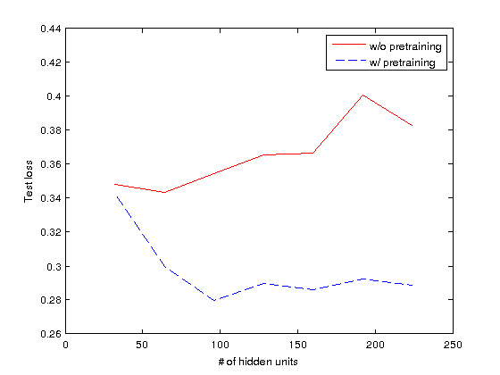
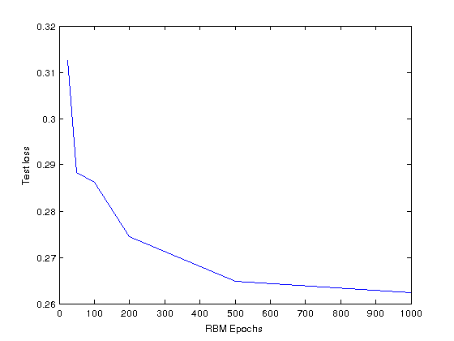

% CSC 321 - Assignment 4
% Zeeshan Qureshi (997108954)
% 2 Apr 2013

Part 1
------

**rbmfun** parameters:

  + Hidden Units = 160
  + Weight Cost = 0.005
  + Epochs = 100

**a4** parameters:

  + Weight Decay = 0.001
  + Hidden Units = 160
  + Iterations = 4000
  + Learning Rate = 0.05
  + Momentum = 0.5
  + Early Stopping = True
  + Mini Batch  = 10

Lowest Error Rate (w/ Pre-training):
  : 8.45%

Lowest Error Rate (w/o Pre-training):
  : 11.08%

I initially started with $256$ hidden units and was able to reach about
$23$% error rate but the test loss was very wobbly at the end showing
that the learning rate was too high and it was stuck around the minima.
I then turned down the learning rate and increased the momentum value
which smoothed out the loss curve and also provided a very fast drop in
loss over the first few iterations. This gave me an error rate of
$8.8$%. I then tried out a different number of hidden units and reached
$8.45$% error at $160$ units.

\clearpage

Part 2
------

In the graph we can clearly see that the worst performance with
pre-training is clearly better than the best performance without it and
the gap only increases as the number of hidden units go up. We can also
see that without pre-training the model quickly overfits the data and
hence loss goes up but with pre-training the model remains generalized
for much longer and will overfit at a much higher number of units. Thus
with pre-training we can get a more powerful model without sacrificing
generalization.

\clearpage

Part 3
------

As we can see, even by going from 20 to 1000 epochs the test loss only
decreases by 5% which shows that with 2 orders of magnitude increase in
epochs the loss decrease was insignificant and thus it is highly
unprobable that the model could be overfitted by performing too many RBM
training iterations.
